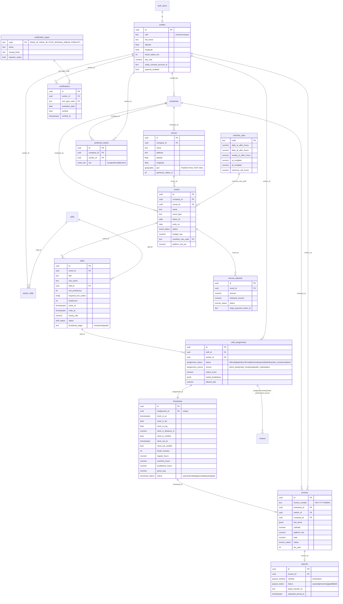

# Flexzora — Event-Production Crew Marketplace

**Product Requirements, Architecture & Schema Specification**

Flexzora is a two-sided labor marketplace strictly for the concert, festival, and corporate-event production industry. It connects independent crew (stagehands, A1/A2 audio, L1/L2 lighting, ETCP riggers, video/LED engineers, carpenters, forklift operators) with production companies (promoters, corporate AV houses, labor brokers).

| Side | Replaces | Flexzora delivers |
|---|---|---|
| Production companies | Excel crew sheets, SMS groups, paper timesheets, month-end reconciliation | Event → shift roster builder, smart-matched crew, roster-first broadcast, geofenced timesheets, one-click approve → invoice → payout, live budget/escrow |
| Workers | Word-of-mouth calls, text-message confirmations, hand-written hours, chasing checks | Verified digital credentials, ranked shift feed, direct-book offers, GPS clock-in, automatic invoices, tax-year earnings ledger |

---

## 1. User roles & stories

### Workers
| # | Story | Implemented in |
|---|---|---|
| W1 | Showcase verified certs (OSHA-10/30, ETCP Arena/Theatre, forklift, aerial lift, fall protection) with expiry | `certification_types`, `certifications.cert_type_code/verified/expiration_date` |
| W2 | Rate primary/secondary/tertiary skills (tier 1–5) | `worker_skills.proficiency_level`; shifts gate on `min_proficiency` |
| W3 | Browse open calls ranked by Match % and see *why* | `/shifts` → `ShiftMarketplacePage`, `MatchScoreBadge` breakdown popover |
| W4 | Receive Direct-Book offers from companies whose roster I'm on; accept/decline in one tap | `shift_assignments.status='offered'`, realtime subscription, Offers tab |
| W5 | Clock in/out only when physically at the venue | `ClockCard` + `validate_clock_event` RPC (PostGIS distance vs. `venues.geofence_radius_m`) |
| W6 | See upcoming payouts, invoices, and taxable earnings per year; export | `/payouts` → `PayoutsPage` (ACH/instant status, invoice line items, CSV export by `tax_year`) |

### Production companies
| # | Story | Implemented in |
|---|---|---|
| C1 | Create a multi-day event at a geofenced venue with a labor budget and regional OT rule | `/events` → `EventForm` (`events`, `venues`, `overtime_rules`) |
| C2 | Add modular calls: "4 Ground Riggers, Oct 12 08:00–16:00, $32/hr, ETCP required" | `ShiftForm` → `shifts` (`headcount`, `required_cert_codes[]`, `min_proficiency`) |
| C3 | See every day of the event as a lane with fill status per call | `RosterBoard` (day columns × shift cards, confirmed/headcount, pending badges) |
| C4 | Rank the local labor pool by Match % and direct-book the best | `CandidatesPanel` → `MarketplaceService.rankCandidates` |
| C5 | Broadcast to my trusted roster first, then release to the public marketplace | `shifts.broadcast_stage: none → roster → public`; `publishEvent` broadcasts all drafts to roster |
| C6 | Maintain a Core / Preferred / Blocked crew list | `/roster` → `RosterPage` (`preferred_rosters.tier`) |
| C7 | Approve GPS-verified timesheets with auto-OT, adjust breaks, dispute | `/timesheets` → `TimesheetApprovalPage` |
| C8 | One click: approve → release escrow → issue invoice → start ACH/instant payout | `approve_timesheet` RPC (atomic) |
| C9 | Watch projected vs. approved labor vs. escrow vs. budget cap in real time | `BudgetSummary` (`getEventBudget`) |

---

## 2. Smart Matching engine

Implemented in `src/lib/marketplace/matchScore.ts` (pure, unit-tested) and used identically by the company candidate ranker and the worker shift feed.

### 2.1 Gatekeeper (mandatory, binary)
A worker is **ineligible (score = 0)** for a shift if any of:
1. Any code in `shift.required_cert_codes` is missing, unverified, inactive, or expired at `shift.starts_at` — *e.g. every Rigger call carries `ETCP_RIGGING_ARENA`, so non-ETCP crew never see it.*
2. `shift.skill_id` is set and the worker's `proficiency_level` for that skill < `shift.min_proficiency`.
3. The worker is `blocked` on the hiring company's roster.

### 2.2 Weighted score (0–100)

```ts
export const MATCH_WEIGHTS = { proximity: 0.30, availability: 0.30, performance: 0.20, roster: 0.20 };
score = Σ weight_i × component_i        // each component ∈ [0,100]
```

| Component | Weight | Formula |
|---|---|---|
| **Proximity** | 30 % | Haversine distance worker → venue. 100 within 10 km, linear decay to 0 at `worker.travel_radius_km` (default 80). Unknown coords → 50 (neutral). |
| **Availability** | 30 % | 0 if any *confirmed* booking overlaps the shift window; 60 if a booking ends/starts within 8 h (tight turnaround); otherwise 100. Also checks explicit `availability` blocks. |
| **Historical performance** | 20 % | `0.6 × (avg_rating / 5 × 100) + 0.4 × reliability_rate`, where `reliability_rate = completed / (completed + no_shows + late withdrawals)`. New workers with no history → 60 (neutral). |
| **Preferred roster** | 20 % | `core` = 100, `preferred` = 80, not on roster = 0. |

Every result carries a `breakdown` (`proximity`, `availability`, `performance`, `roster`, `distanceKm`, `gatekeeperPassed`, `gatekeeperReasons`) and human-readable `reasons[]`, persisted on `shift_assignments.match_breakdown` so the manager sees the same explanation the worker saw.

### 2.3 Broadcast cascade
```
draft ──publish──▶ roster (only Core/Preferred see it) ──"Open to public"──▶ public
```
Workers on the roster get a **Roster early access** badge; companies can direct-book at any stage.

---

## 3. Time tracking, overtime & money flow

```
Worker taps Clock in ─▶ browser GPS ─▶ validate_clock_event(assignment, 'in', lat, lng)
   └─ PostGIS ST_Distance(venue.geo, point) ≤ geofence_radius_m ? verified : rejected
Worker taps Clock out ─▶ same check ─▶ timesheet.status = 'submitted'
Manager reviews ─▶ sees GPS distance, auto OT preview (regional rule), adjusts break
Manager clicks Approve & pay ─▶ approve_timesheet(timesheet, break, 'instant'|'ach')  [single transaction]
   ├─ splits hours: regular / OT / DT via overtime_rules (daily + weekly thresholds, min-call)
   ├─ timesheets.status = 'approved', gross_pay computed
   ├─ invoices: INV-YYYY-000001, line_items[], subtotal, platform_fee, total, tax_year
   ├─ escrow_deposits.released_amount += total (status → partially_released / released)
   ├─ payouts: method, status queued, expected_arrival (instant = now, ACH = +2 days)
   └─ shift_assignments.status = 'completed'
Stripe Connect webhook (Phase 1.4) ─▶ payouts.status = paid, invoices.status = paid, timesheets.status = paid
```

Regional overtime rules shipped: `US_FLSA` (40 h weekly ×1.5), `CA_DAILY` (8 h ×1.5, 12 h ×2, 4 h min call), `IATSE_STD` (8 h ×1.5, 12 h ×2, 40 h weekly, 5 h min call). Rule is selected per event.

---

## 4. Feature roadmap

### Phase 1 — MVP: schedule & payment automation
| Sprint | Deliverable | Status |
|---|---|---|
| 1.1 | Marketplace schema (venues, events, shifts, assignments, rosters, timesheets, escrow, invoices, payouts), PostGIS, RLS, RPCs | **Done** (`20260928220000_marketplace_core.sql`) |
| 1.1 | Event builder, multi-lane roster board, shift form with cert gates | **Done** |
| 1.1 | Match engine (gatekeeper + 30/30/20/20) with explainable breakdown; candidate ranking; worker feed | **Done** |
| 1.1 | Roster-first → public broadcast; direct-book offers; apply/confirm/decline; realtime updates | **Done** |
| 1.1 | Geofenced clock-in/out; regional OT calculator; timesheet approval & dispute | **Done** |
| 1.1 | Approve → escrow release → invoice → payout record; worker earnings ledger & CSV | **Done** |
| 1.2 | Push + SMS notifications (Twilio) for offers, confirmations, clock reminders, approvals — Edge Function on `shift_assignments` / `timesheets` triggers | Next |
| 1.2 | Stripe Connect Express onboarding for workers (`profiles.stripe_connect_account_id`), escrow funding via PaymentIntent, Transfer on approval, webhook → `payouts.status` | Next |
| 1.3 | Certification verification workflow (document upload → admin review → `verified_at`); expiry reminders 60/30/7 days | Next |
| 1.3 | Drag-and-drop crew between calls on `RosterBoard`; shift templates ("Arena load-in pack") | Next |
| 1.4 | Company-side 1099-NEC export; worker annual earnings statement PDF | Next |
| 1.4 | Mobile app (Expo/React Native) reusing `MarketplaceService`, background geofence enter/exit prompts | Next |

### Phase 2 — Advanced matching & analytics
| Theme | Deliverable |
|---|---|
| Matching v2 | Learn per-company weight adjustments from confirm/decline outcomes; role-specific decay curves (riggers travel further than stagehands); crew-chief "bring my team" bundles |
| Availability | Two-way calendar sync (Google/iCal), travel-time feasibility between consecutive venues (Mapbox Matrix), standby/on-call pools |
| Reliability | No-show prediction (late confirmations, distance, weather); automatic backfill cascade to next-ranked candidate on decline |
| Company analytics | Fill-rate & time-to-fill per role/venue, labor cost vs. budget burn-down per event, OT exposure forecast, roster health (churn, expiring certs) |
| Worker analytics | Earnings trends, acceptance rate, rating history, "what unlocks more calls" credential suggestions |
| Compliance | Union/local rule packs (meal penalties, turnaround pay), state-specific tax withholding flags, I-9/W-9 vault |
| Marketplace ops | Dynamic rate guidance from cleared rates by role × market; surge indicators during festival season; dispute mediation queue |

---

## 5. Entity-Relationship schema



**Key relationships**
- A *shift* is the unit of hiring; an *assignment* is one worker × one shift (unique). An assignment has exactly one *timesheet*; an approved timesheet has exactly one *invoice*; an invoice has one *payout*.
- *Escrow* is per event and drawn down by invoice totals.
- Certification codes on `shifts.required_cert_codes` reference `certification_types.code`, and matching joins through `certifications.cert_type_code` — so adding a new credential is a single row insert, no code change.

**Security (RLS)**: companies read/write only their own venues, events, shifts, rosters, escrow; workers see `open` shifts on `published` events (roster-only stage filtered to roster members in the service layer and enforceable in policy), their own assignments/timesheets/invoices/payouts. Clock and approval mutations go through `SECURITY DEFINER` RPCs that re-check ownership.

**RPCs**: `nearby_shifts(lat,lng,radius_m)` (PostGIS radius search), `worker_reliability(worker_id)`, `validate_clock_event(...)`, `approve_timesheet(...)`.

---

## 6. Wireframe / UI flow outlines

### 6.1 Production manager — web dashboard

```
┌ Nav: Dashboard · Events · Timesheets · Roster · Gigs · Workforce · Finances ────────────┐
│                                                                                         │
│ /events                                                                                 │
│ ┌──────────────────────────────┐ ┌──────────────────────────────┐   [ + New event ]     │
│ │ ▍Fall Arena Tour – Night 1   │ │ ▍Acme Corp Keynote           │                       │
│ │  Oct 12–14 · concert         │ │  Oct 20 · corporate           │                      │
│ │  📍 Crypto Arena             │ │  📍 Convention Ctr Hall B     │                      │
│ │  18/24 crew ▓▓▓▓▓▓░░ 6 calls │ │  4/4 crew ▓▓▓▓▓▓▓▓ 2 calls    │                      │
│ └──────────────────────────────┘ └──────────────────────────────┘                       │
│   New event dialog: name · type · OT rule · load-in/out dates · venue (+ inline new     │
│   venue w/ lat-lng & geofence radius) · budget cap · notes                              │
│                                                                                         │
│ /events/:id                                                                             │
│ ┌ Crew 18/24 ┐┌ Projected $41,920 (cap $45k) ┐┌ Approved $12,300 ┐┌ Escrow $30k [Fund] ┐│
│ ┌──────────── Schedule & roster (multi-lane) ─────────────┐ ┌── Selected call ────────┐ │
│ │ Sun Oct 12 (3)   Mon Oct 13 (2)   Tue Oct 14 (1)        │ │ Load-in riggers  4/4 ✓  │ │
│ │ ┌────────────┐   ┌────────────┐   ┌────────────┐        │ │ Ground Rigger · 08–16   │ │
│ │ │Load-in     │   │Show call   │   │Load-out    │        │ │ ETCP RIGGING required   │ │
│ │ │riggers 4/4 │   │A2 audio 2/2│   │stagehands  │        │ │ [Broadcast roster][Public]│ │
│ │ │08–16 $32   │   │14–23 $38   │   │12/16 22–04 │        │ │ ─ Smart match ─ Applicants│ │
│ │ │Roster·ETCP │   │Public      │   │Public·2 pend│       │ │ ● Maria R.  94% ★ 3 km  │ │
│ │ └────────────┘   └────────────┘   └────────────┘        │ │          [Direct book]  │ │
│ │ ┌────────────┐                                          │ │ ● Dev P.    81%   12 km │ │
│ │ │Load-in     │   … click card → right panel             │ │ ● J. Ortiz  Not eligible│ │
│ │ │stagehands  │                                          │ │   (ETCP missing)        │ │
│ │ │10/12 09–17 │                                          │ │ Match % popover: bars   │ │
│ │ └────────────┘                                          │ │  Prox 30 · Avail 30 ·   │ │
│ └──────────────────────────────────────────────────────────┘ │  Perf 20 · Roster 20    │ │
│   [ + Add shift ]  [ 🚀 Publish to roster ]                  └─────────────────────────┘ │
│   Add shift dialog: role preset (auto-adds ETCP/forklift gate) · call/wrap time ·        │
│   headcount · rate · min tier · skill · cert checkboxes · notes · projected cost         │
│                                                                                         │
│ /timesheets                                    Awaiting approval: $4,812                │
│ [Needs review 6] [On the clock 9] [Approved & paid 42]                                  │
│ ┌─────────────────────────────────────────────────────────────────────────────────────┐ │
│ │ Maria R. · Load-in riggers · Fall Arena   In 07:52 ✓GPS 41 m   Reg 8.00h  $256.00   │ │
│ │ $32/hr                                    Out 17:40 ✓GPS 12 m  OT 1.30h   $ 62.40   │ │
│ │ ⚠ Ran past scheduled wrap — OT applied    Break [30] min       ────────── $318.40   │ │
│ │                                           [Dispute] [🏦 ACH] [⚡ Approve & pay]      │ │
│ └─────────────────────────────────────────────────────────────────────────────────────┘ │
│   Approve → toast "invoice INV-2026-000117 issued, instant payout initiated"            │
│                                                                                         │
│ /roster   Core / Preferred / Blocked list with tier selector; add from Smart match ★    │
└─────────────────────────────────────────────────────────────────────────────────────────┘
```

### 6.2 Stagehand — mobile view (`/shifts`, `/payouts`; responsive now, Expo app in 1.4)

```
┌──────────────────────────────┐   ┌──────────────────────────────┐   ┌──────────────────────────────┐
│ Shifts                       │   │ Direct offers (1) ⚡          │   │ My bookings                  │
│ [Marketplace][Offers⚡][Book.]│   │ ┌──────────────────────────┐ │   │ ┌──────────────────────────┐ │
│ 🔍 role, company, city       │   │ │ Show call A2      92% ✓  │ │   │ │▍Load-in riggers          │ │
│ ┌──────────────────────────┐ │   │ │ Acme AV · Keynote        │ │   │ │ Fall Arena Tour · LiveCo │ │
│ │ Load-in riggers          │ │   │ │ Mon Oct 20 14:00–23:00   │ │   │ │ Sun Oct 12 08:00–16:00   │ │
│ │ Ground Rigger  ★Roster   │ │   │ │ 📍 Conv. Ctr · 6 km      │ │   │ │ 📍 Crypto Arena          │ │
│ │ [94% match ▾]            │ │   │ │ $38/hr ≈ $380 incl. OT   │ │   │ │ "Steel toes, harness"    │ │
│ │ LiveCo · Fall Arena Tour │ │   │ │        [ ✕ ]  [✓ Accept] │ │   │ │              [Confirmed] │ │
│ │ Sun Oct 12 · 08–16 · 8h  │ │   │ └──────────────────────────┘ │   │ │                          │ │
│ │ 📍 Crypto Arena, LA·3 km │ │   │                              │   │ │ Clock-in opens 60 min    │ │
│ │ ETCP RIGGING ARENA       │ │   │ Tap 94% → breakdown sheet:  │   │ │ before call   [🔓 Clock in]│ │
│ │ $32/hr ≈ $256    [Apply] │ │   │  Proximity  ▓▓▓▓▓▓▓▓▓░ 96   │   │ └──────────────────────────┘ │
│ └──────────────────────────┘ │   │  Availability▓▓▓▓▓▓▓▓▓▓100  │   │  Clock in →                  │
│ ┌──────────────────────────┐ │   │  Performance ▓▓▓▓▓▓▓▓░░ 84  │   │   "Getting GPS fix…"         │
│ │ Load-out stagehands      │ │   │  Roster      ▓▓▓▓▓▓▓▓░░ 80  │   │   "Inside geofence (41 m)"   │
│ │ [71% match ▾]  Public    │ │   │  · Core crew for LiveCo     │   │   badge → [On the clock]     │
│ │ …                        │ │   │  · 8h turnaround after…     │   │  Outside fence →             │
│ └──────────────────────────┘ │   │                              │   │   ✗ "You're 812 m from …"    │
│ (ineligible calls hidden)    │   │                              │   │  [Clock out] → "submitted"   │
└──────────────────────────────┘   └──────────────────────────────┘   └──────────────────────────────┘

┌──────────────────────────────┐
│ Earnings & payouts  [2026 ▾] │
│ Upcoming $318 · Paid $12,430 │
│ Gross $14,120 · fees $1,690  │
│ [Payouts][Invoices][By co.]  │
│ ⚡ Fall Arena · LiveCo  $318 │
│    Instant · Expected Oct 13 │
│                     [queued] │
│ 🏦 Keynote · Acme AV   $380 │
│    ACH · Paid Oct 22   [paid]│
│ INV-2026-000117              │
│   Regular 8.00h @ $32  $256  │
│   Overtime 1.30h @ $48 $62.40│
│   − platform fee $38.21      │
│ [⬇ Export CSV for taxes]     │
└──────────────────────────────┘
```

---

## 7. System architecture

### 7.1 Current (shipped in this repo)

```
┌─────────────────────────── Clients ───────────────────────────┐
│ React 18 + Vite + TypeScript + Tailwind/shadcn (web, responsive)│
│ src/lib/marketplace/{matchScore,overtime,geo}.ts  ← pure, tested│
│ src/lib/marketplace/service.ts  ← MarketplaceService (Supabase)│
│ Browser Geolocation API → geofence pre-check → RPC             │
└───────────────┬───────────────────────────────┬───────────────┘
                │ supabase-js (REST + RPC)      │ Realtime (Postgres CDC on shifts / shift_assignments)
┌───────────────▼───────────────────────────────▼───────────────┐
│ Supabase                                                       │
│  Postgres 15 + PostGIS  (venues.geo GIST, nearby_shifts)        │
│  RLS per company / worker                                       │
│  SECURITY DEFINER RPCs: validate_clock_event, approve_timesheet │
│  Edge Functions (Deno): stripe webhooks, notifications          │
│  Auth (email/OAuth) → profiles.role                             │
└───────────────┬────────────────────────────────────────────────┘
                │
     ┌──────────▼──────────┐   ┌──────────────┐   ┌────────────┐
     │ Stripe Connect       │   │ Twilio        │   │ Expo Push  │
     │ Express accounts,    │   │ SMS offers /  │   │ (Phase 1.4)│
     │ PaymentIntent escrow,│   │ confirmations │   └────────────┘
     │ Transfer on approval │   └──────────────┘
     └─────────────────────┘
```

### 7.2 Recommended target stack

| Layer | Recommendation | Why |
|---|---|---|
| Mobile | **Expo (React Native)** sharing `src/lib/marketplace/*` and `MarketplaceService` via a workspace package | Same TS domain code as web; `expo-location` background geofencing prompts "You've arrived — clock in?"; OTA updates for crews in the field |
| Web | React + Vite (current) | Production managers live on laptops; multi-lane board benefits from wide screens |
| API | **Supabase (PostgREST + RPC) now → Node.js (Fastify/NestJS) service for orchestration when needed** | Postgres-native RLS and realtime cover CRUD; a thin Node service owns Stripe webhooks, Twilio fan-out, matching batch jobs, and any FastAPI/ML scoring later |
| Realtime | Supabase Realtime (Postgres CDC) → WebSocket | Already wired for shifts/assignments; roster board and worker feed update live without polling |
| Database | **PostgreSQL 15 + PostGIS** | `geography(Point)` + GIST for radius search and geofence distance; enums + jsonb for match breakdown/line items |
| Payments | **Stripe Connect (Express) + Treasury/Instant Payouts** | Split-fee marketplace: company PaymentIntent → platform balance (escrow) → `Transfer` to worker on approval; instant payouts for debit cards; 1099-NEC via Stripe Tax forms |
| Notifications | Twilio (SMS), Expo Push, Resend (email) from Edge Functions on DB triggers | Crew still lives in SMS; push once app installed |
| Jobs | pg_cron / Supabase scheduled functions | Cert-expiry reminders, roster→public auto-release after N hours, no-show detection at call time + 30 min |
| Analytics (Phase 2) | Postgres materialized views → Recharts (current) / ClickHouse if volume warrants | Fill-rate, time-to-fill, OT exposure |
| Infra | Vercel (web) · Supabase (DB/Auth/Edge) · EAS (mobile builds) | Zero-ops for a lean team |

### 7.3 Code map

```
supabase/migrations/20260928220000_marketplace_core.sql   schema, enums, RLS, RPCs, seed cert types & OT rules
src/lib/types.ts                                          marketplace domain types (+ Database table map)
src/lib/marketplace/matchScore.ts                         gatekeeper + 30/30/20/20 engine, rankWorkersForShift
src/lib/marketplace/overtime.ts                           splitHours / calculatePay / projectedShiftCost
src/lib/marketplace/geo.ts                                haversine, checkGeofence, getCurrentPosition
src/lib/marketplace/service.ts                            MarketplaceService — all Supabase I/O + realtime
src/lib/marketplace/__tests__/                            vitest coverage of the engines
src/hooks/useMarketplace.ts                               data hooks (company, events, shifts, rosters, payouts)
src/pages/company/{EventsPage,EventDetailPage,TimesheetApprovalPage,RosterPage}.tsx
src/pages/worker/{ShiftMarketplacePage,PayoutsPage}.tsx
src/components/marketplace/company/{EventForm,ShiftForm,RosterBoard,CandidatesPanel,BudgetSummary}.tsx
src/components/marketplace/worker/ClockCard.tsx
src/components/marketplace/MatchScoreBadge.tsx
```
